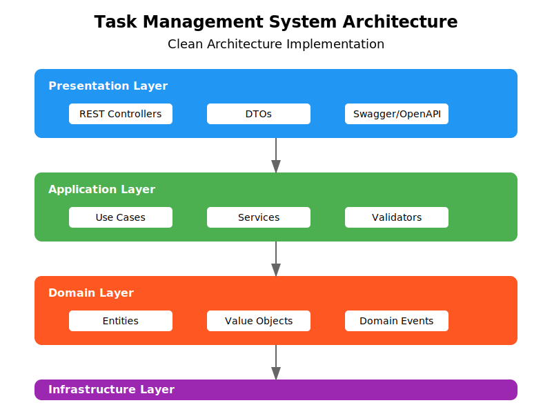
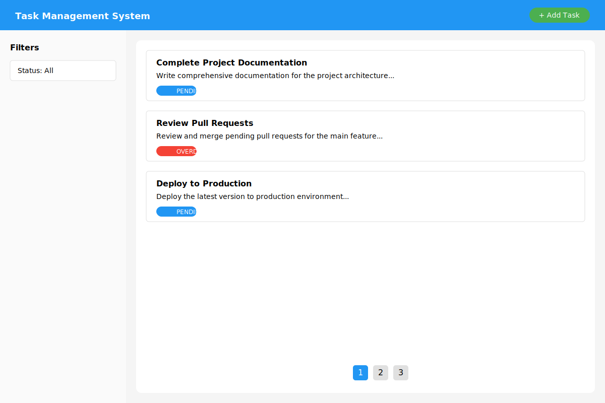

# Mi Cuento Test Project

<div align="center">



</div>

## Overview

Mi Cuento Test is a modern web application that demonstrates a full-stack implementation using cutting-edge technologies. The project is structured as a monorepo using pnpm workspaces, consisting of a frontend application built with React and Vite, and a backend service powered by NestJS.

## Project Structure

```
├── docs/               # Project documentation and diagrams
├── packages/
│   ├── backend/        # NestJS backend service
│   └── frontend/       # React + Vite frontend application
└── README.md          # This file
```

## Architecture

The application follows a modern microservices architecture:

- **Frontend**: A React application built with Vite, providing a responsive and intuitive user interface.
  - [Frontend Documentation](packages/frontend/README.md)

- **Backend**: A NestJS service handling business logic and data persistence.
  - [Backend Documentation](packages/backend/README.md)

## UI Design

<div align="center">



</div>

## Getting Started

### Prerequisites

- Node.js (v18 or higher)
- pnpm (v8 or higher)

### Installation

1. Clone the repository:
   ```bash
   git clone https://github.com/your-username/mi-cuento-test.git
   cd mi-cuento-test
   ```

2. Install dependencies:
   ```bash
   pnpm install
   ```

3. Set up environment variables:
   - Copy `.env.template` files in both frontend and backend packages
   - Configure the environment variables according to your needs

### Running the Application

#### Development Mode

Start both frontend and backend services in development mode:

```bash
pnpm dev
```

This command will:
- Start the backend service on port 3000
- Launch the frontend development server on port 5173

#### Production Build

Build both packages for production:

```bash
pnpm build
```

## Contributing

1. Fork the repository
2. Create your feature branch (`git checkout -b feature/amazing-feature`)
3. Commit your changes (`git commit -m 'Add some amazing feature'`)
4. Push to the branch (`git push origin feature/amazing-feature`)
5. Open a Pull Request

## License

This project is licensed under the MIT License - see the LICENSE file for details.